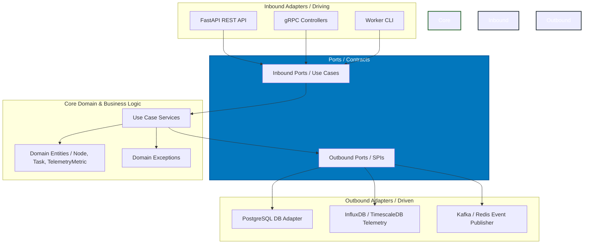

# ⚡ GPU Fleet Commander ⚡

[](https://opensource.org/licenses/MIT)
[](https://www.python.org/)
[](https://flox.dev/)
[](https://en.wikipedia.org/wiki/Hexagonal_architecture_(software))

**GPU Fleet Commander** is a lightweight, high-performance Control Plane designed for orchestrating distributed computing nodes (such as server clusters or NVIDIA Jetson edge systems). It handles real-time node registration, heartbeat telemetry monitoring, and idempotent task dispatching.

Built with a **pure domain model** following strict **Hexagonal Architecture** (Ports and Adapters) principles, the system isolates core business logic from databases and web frameworks, facilitating elite testability and scalability.

---

## 🏗️ Architectural Blueprint

The codebase enforces a unidirectional dependency flow pointing **inward** toward the pure domain model. Infrastructure components (Web APIs, Databases, Message Brokers) are plugged in via interfaces (Ports).



---

## ✨ Key Technical Highlights

- **Pure Domain Isolation**: No ORM annotations (`SQLAlchemy`, `Django`) or framework decorators (`FastAPI`) touch the domain models. The domain is pure Python 3.12.
- **Immutable State Transitions**: Entities are modeled using `@dataclass(frozen=True)`. State transitions return new mutated instances, eliminating side effects and enhancing race-condition safety.
- **Reproducible Environments with Flox**: All system dependencies (Python 3.12, PostgreSQL 16, Redis) are managed declaratively in a `.flox/env/manifest.toml`. Developers can initialize the complete workspace with one command.
- **Task Idempotency**: Built-in mechanisms to handle network retries gracefully using client-provided idempotency keys.
- **Telemetry Ingestion**: Clean contracts designed for high-frequency telemetry streaming (CPU, GPU, Temperature metrics).

---

## 📂 Project Structure

```text
.
├── .flox/                      # Declarative Nix-based virtual environments
│   └── env/
│       └── manifest.toml       # Environment packages (Postgres, Redis, Python, uv)
├── src/
│   ├── core/                   # 🛑 Pure Domain - No frameworks allowed
│   │   ├── domain/             # Entities, Value Objects, Domain Exceptions
│   │   ├── ports/              # Inbound & Outbound Interfaces (contracts)
│   │   └── use_cases/          # Business logic services
│   ├── adapters/               # 🔌 Infrastructure & Adapters (Web, DB, Redis)
│   │   ├── inbound/
│   │   └── outbound/
│   └── config/                 # Dependency injection setup
├── tests/
│   ├── unit/                   # High-speed unit tests (no databases required)
│   └── integration/            # Test adapters against real Postgres/Redis inside Flox
├── .gitignore
├── LICENSE
└── README.md
```

---

## 🚀 Quick Start (via Flox)

1. **Install Flox** if you haven't already:
   Follow the official instructions at [flox.dev](https://flox.dev/docs/install-flox/install/).

2. **Clone and Enter Environment**:
   ```bash
   git clone https://github.com/Casta2007-ccs/gpu-fleet-commander.git
   cd gpu-fleet-commander
   flox activate --start-services
   ```
   *This command installs Python 3.12, PostgreSQL, Redis, sets up a clean virtual environment using `uv`, and boots database background services locally inside a user-space sandbox.*

3. **Verify Installation**:
   ```bash
   run-tests
   ```

---

## 📄 License

This project is licensed under the MIT License - see the [LICENSE](LICENSE) file for details.
