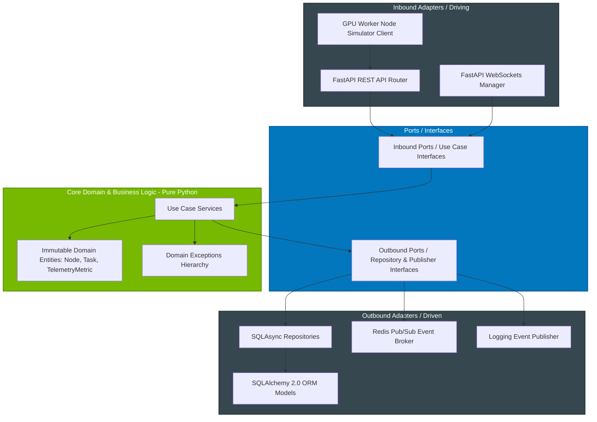

# ⚡ GPU Fleet Commander ⚡

[](https://github.com/Casta2007-ccs/gpu-fleet-commander/actions)
[](https://opensource.org/licenses/MIT)
[](https://www.python.org/)
[](https://fastapi.tiangolo.com/)
[](https://docs.pydantic.dev/)
[](https://www.sqlalchemy.org/)
[](https://www.docker.com/)
[](https://flox.dev/)
[](https://en.wikipedia.org/wiki/Hexagonal_architecture_(software))
[](https://github.com/astral-sh/ruff)
[](https://mypy-lang.org/)

**GPU Fleet Commander** is an enterprise-grade, high-performance **Control Plane** designed for orchestrating decentralized GPU computing infrastructure at scale (ranging from cloud server clusters to edge NVIDIA Jetson nodes). It handles real-time worker node registrations, keepalive heartbeats, idempotent computational task dispatching, and live telemetry streaming via WebSockets to a centralized control panel.

Engineered around **Pure Hexagonal Architecture (Ports and Adapters)**, the core domain logic remains 100% decoupled from web frameworks and database ORMs. This ensures zero framework leakage, deterministic testability with in-memory domain doubles, and multi-cloud infrastructure flexibility.

---

## 📸 System Overview & Visual Previews

### Real-Time Fleet Telemetry Dashboard

*NVIDIA-themed control panel with live-drawn CPU, GPU, and core temperature telemetry charts powered by Chart.js and WebSockets.*

### Concurrent GPU Node Worker Simulator

*Simulated hardware worker nodes reporting telemetry metrics and heartbeats with automatic exponential backoff and connection recovery.*

---

## 💡 Key Architectural Highlights & Engineering Excellence

* 🛡️ **Pure Hexagonal Architecture (Ports & Adapters)**: Strict inward dependency rules. The core domain layer (`src/core`) contains zero imports from FastAPI, SQLAlchemy, HTTPX, or Pydantic. Domain logic can be re-used across CLI tools, gRPC services, or alternative web engines without modifications.
* ⚡ **100% Asynchronous Non-Blocking I/O**: End-to-end async execution model using `async/await`, FastAPI, and SQLAlchemy 2.0 async engine backed by `asyncpg` for PostgreSQL and `aiosqlite` for test environments.
* 🔐 **Control Plane Security & Token Auth**: All node registrations, keepalives, telemetry ingestions, and task mutation endpoints require `X-API-Key` authentication headers. WebSockets connections are validated via `?api_key=` query tokens prior to protocol handshake acceptance.
* 🔄 **Resilient Redis Pub/Sub Telemetry Broker**: Supports multi-process / multi-worker horizontal scaling. Ingested metrics are published to a Redis Pub/Sub channel (`telemetry_channel`) with automatic background reconnection loops. Fallbacks gracefully to local in-memory broadcast if Redis is disabled.
* 🎯 **Idempotent Task Dispatching Engine**: Eliminates duplicate task processing in distributed loops. Duplicate task creation requests return existing task records based on client-provided `idempotency_key` tokens.
* 🔒 **Immutable Domain Entities**: Core models (`Node`, `Task`, `TelemetryMetric`) are frozen dataclasses (`@dataclass(frozen=True)`). State mutations occur safely via explicit copy-on-write transitions (`dataclasses.replace`), preventing race conditions.
* 🐳 **Production Containerization**: Ships with multi-stage `Dockerfile` (non-root `appuser` security posture), `.dockerignore` optimization, and `docker-compose.yml` with healthchecks (`python -c urllib`) and cascading dependency ordering (`service_healthy`).
* 🧪 **Comprehensive Double Test Suite (Unit + Integration)**: 100% test pass rate combining fast domain unit tests (using pure Python in-memory fakes) and database integration tests (using `aiosqlite` in-memory SQL execution).

---

## 🚀 Quickstart Guide

You can run the entire system (Database, Redis Broker, Control Plane API, Dashboard, and Simulated GPU Workers) in under 60 seconds using Docker Compose or Flox.

### Option A: Docker & Docker Compose (Recommended for Instant Setup)

Ensure you have [Docker](https://www.docker.com/) installed.

```bash
# Clone the repository
git clone https://github.com/Casta2007-ccs/gpu-fleet-commander.git
cd gpu-fleet-commander

# Launch PostgreSQL, Redis, API, and 2 Worker Node Simulators
docker compose up --build
```

Access the **Fleet Control Panel Dashboard** at: `http://localhost:8000/`

---

### Option B: Flox / Nix Environment (Declarative Local Development)

[Flox](https://flox.dev/) provides a reproducible development environment with pre-configured PostgreSQL 16, Redis, and Python 3.12.

```bash
# 1. Clone and enter the environment
git clone https://github.com/Casta2007-ccs/gpu-fleet-commander.git
cd gpu-fleet-commander
flox activate --start-services

# 2. Initialize local PostgreSQL cluster and create database
make init
make start
make create-db

# 3. Start the Control Plane API
make run
```

In a separate terminal window, launch simulated worker nodes:
```bash
python cmd/worker/main.py
```

---

## 🏗️ Architectural Blueprint

### Unidirectional Dependency Flow



### Complete Codebase Layout

```text
gpu-fleet-commander/
├── .github/
│   └── workflows/
│       └── ci.yml                   # CI pipeline (Linting, Compilation, Pytest)
├── cmd/
│   ├── api/
│   │   └── main.py                  # API Entrypoint, Lifespan, CORS & Exception Handlers
│   └── worker/
│       └── main.py                  # Async GPU Worker Client Simulator (HTTPX)
├── public/
│   └── index.html                   # Live Web Dashboard (Tailwind CSS + Chart.js + WS)
├── src/
│   ├── __init__.py
│   ├── core/                        # 🛑 Pure Core Domain (Zero Framework Dependencies)
│   │   ├── __init__.py
│   │   ├── domain/                  # Frozen Entities & Custom Domain Exceptions
│   │   │   ├── entities.py
│   │   │   └── exceptions.py
│   │   ├── ports/                   # Abstract Driving & Driven Interfaces
│   │   │   └── interfaces.py
│   │   └── use_cases/               # Core Orchestration Services
│   │       ├── node_provisioning.py
│   │       ├── task_orchestrator.py
│   │       └── telemetry_ingestion.py
│   └── adapters/                    # 🔌 Infrastructure & Framework Adapters
│       ├── __init__.py
│       ├── inbound/                 # Routers, Pydantic V2 Schemas & WebSocket Manager
│       │   ├── api_schemas.py
│       │   ├── routers.py
│       │   └── websocket_manager.py
│       └── outbound/                # Async Repositories, ORM Models & Event Publishers
│           ├── database.py
│           ├── event_publisher.py
│           ├── orm_models.py
│           └── sql_repositories.py
├── tests/
│   ├── __init__.py
│   ├── unit/                        # High-Speed Unit Tests (Pure Python Fakes)
│   │   ├── fakes.py
│   │   ├── test_node_provisioning.py
│   │   └── test_task_orchestrator.py
│   └── integration/                 # Database Integration Tests (SQLite/SQLAlchemy)
│       └── test_sql_repositories.py
├── docs/                            # Architectural Decisions & Diagrams
├── .dockerignore                    # Production Docker build exclusions
├── Dockerfile                       # Multi-stage non-root runtime container
├── docker-compose.yml               # Multi-service stack composition
├── Makefile                         # Cross-platform developer task runner
├── pyproject.toml                   # Ruff, Mypy & Pytest configuration
├── requirements.txt                 # Production dependencies
└── requirements-dev.txt             # Development & testing dependencies
```

---

## 📡 API & WebSockets Reference

All REST endpoints map to strict Pydantic V2 DTO schemas and require `X-API-Key` authentication headers.

| Method | Endpoint | Description | Request Body | Auth Header | Status Codes |
|:---|:---|:---|:---|:---|:---|
| **GET** | `/` | Serve HTML Fleet Dashboard | None | None | `200 OK` |
| **GET** | `/health` | Healthcheck Endpoint | None | None | `200 OK` |
| **POST** | `/v1/nodes` | Register a new GPU worker node | `{"hostname": "str", "hardware_specs": {}}` | `X-API-Key` | `201 Created`, `401 Unauthorized`, `409 Conflict` |
| **POST** | `/v1/nodes/{id}/heartbeat` | Record worker keepalive heartbeat | None | `X-API-Key` | `204 No Content`, `401 Unauthorized`, `404 Not Found` |
| **POST** | `/v1/nodes/{id}/telemetry` | Record hardware telemetry metrics | `{"cpu_usage": float, "gpu_usage": float, "temperature": float}` | `X-API-Key` | `201 Created`, `401 Unauthorized`, `404 Not Found` |
| **POST** | `/v1/tasks` | Create computational task (Idempotent) | `{"idempotency_key": "str", "payload": {}}` | `X-API-Key` | `201 Created`, `401 Unauthorized` |
| **POST** | `/v1/tasks/{id}/dispatch` | Dispatch task to an online node | `{"node_id": "str"}` | `X-API-Key` | `200 OK`, `401 Unauthorized`, `404 Not Found`, `409 Conflict` |
| **POST** | `/v1/tasks/{id}/transition` | Transition task state | `{"target_status": "COMPLETED"}` | `X-API-Key` | `200 OK`, `401 Unauthorized`, `404 Not Found`, `409 Conflict`, `422 Unprocessable` |
| **WS** | `/v1/ws/telemetry` | Real-time WebSocket telemetry stream | Query param: `?api_key=token` | Query Token | `101 Switching Protocols`, `1008 Policy Violation` |

---

## 🧪 Testing & Quality Assurance

The repository maintains strict quality control with 100% test pass rates and static analysis compliance.

### Running Test Suites

```bash
# Execute unit & database integration test suites
python -m pytest

# Run tests with verbose output
python -m pytest -v
```

### Static Analysis & Type Checking

```bash
# Code style and linting (Ruff)
python -m ruff check src/ cmd/ tests/

# Strict type checking (Mypy)
python -m mypy --ignore-missing-imports --explicit-package-bases src/ cmd/ tests/
```

### Cross-Platform Task Automation (Makefile)

```bash
make test       # Execute test suite via pytest
make lint       # Run Ruff and Mypy checks
make format     # Auto-format codebase with Ruff
make clean      # Cross-platform cleanup of cache & build artifacts
```

---

## 🛡️ Technical Retrospective: Engineering Challenges & Solved Trade-offs

Building a production-ready control plane surfaced complex software engineering trade-offs. Here is how key challenges were systematically analyzed and resolved:

### 1. Endpoint Security Lockdown & WebSocket Handshake Order
* **Challenge**: Initially, task dispatching endpoints were unauthenticated, allowing arbitrary clients to manipulate task states. Additionally, attempting to close an unauthenticated WebSocket connection without accepting it first produced `RuntimeError: Unexpected ASGI message 'websocket.close'`.
* **Resolution**: Enforced `verify_api_key` dependency verification across all REST endpoints. For WebSockets, the endpoint explicitly invokes `await websocket.accept()` prior to checking `api_key == API_KEY`, gracefully closing with `WS_1008_POLICY_VIOLATION` if authentication fails.

### 2. Hexagonal Domain Boundary Protection vs. Framework Exception Leaks
* **Challenge**: Domain services raise custom exceptions (`NodeNotFoundError`, `InvalidTransitionTargetError`). Unhandled domain errors in FastAPI endpoints resulted in generic `500 Internal Server Error` responses, leaking implementation details while failing to supply meaningful HTTP status codes.
* **Resolution**: Implemented global exception handlers in `cmd/api/main.py` and wrapped endpoint handlers in `src/adapters/inbound/routers.py` with explicit try/except blocks converting domain exceptions directly into structured HTTP status responses (`404`, `409`, `422`).

### 3. Static Type Safety with Pydantic V2 and Mypy
* **Challenge**: Returning raw domain dataclass instances (`Node`, `Task`) from FastAPI endpoints relied on runtime ORM conversion (`from_attributes=True`), causing Mypy static type checkers to flag `Incompatible return value type (got Node, expected NodeResponse)`.
* **Resolution**: Updated endpoints to explicitly construct DTO responses using Pydantic V2's `ModelResponse.model_validate(domain_entity)`. This guarantees 100% static type safety under Mypy while keeping DTO conversion explicit.

### 4. Database Foreign Key Integrity Constraints
* **Challenge**: `TaskORM` and `TelemetryMetricORM` stored string `node_id` fields without formal database constraints, allowing orphan records to exist if node records were deleted or corrupted.
* **Resolution**: Added `ForeignKey("nodes.id")` metadata definitions to `orm_models.py`, enforcing strict relational integrity at the database engine level.

### 5. Multi-Worker Telemetry Resiliency & Pub/Sub Reconnection Loop
* **Challenge**: Background Redis subscriber tasks would die permanently if a temporary network blip interrupted the connection, causing all real-time telemetry streaming to stop for the lifetime of the process.
* **Resolution**: Extracted `listen_redis` into a standalone task wrapper with an exponential retry loop inside `cmd/api/main.py`, automatically re-subscribing to `telemetry_channel` upon reconnect.

### 6. Container Security & Dependency Isolation
* **Challenge**: Production containers built from basic Dockerfiles ran as `root`, installed test-only packages (`pytest`), and included unneeded dev files (`.git`, `__pycache__`).
* **Resolution**: Authored a `.dockerignore` file, split dependencies into `requirements.txt` and `requirements-dev.txt`, and updated `Dockerfile` to create and execute under a non-root `appuser` (UID 1000).

---

## 📄 License

This project is licensed under the terms of the **MIT License**. See the [LICENSE](LICENSE) file for details.
