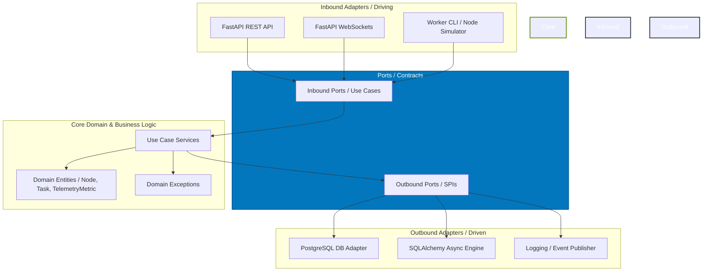

# ⚡ GPU Fleet Commander ⚡

[](https://github.com/Casta2007-ccs/gpu-fleet-commander/actions)
[](https://opensource.org/licenses/MIT)
[](https://www.python.org/)
[](https://fastapi.tiangolo.com/)
[](https://www.sqlalchemy.org/)
[](https://flox.dev/)
[](https://en.wikipedia.org/wiki/Hexagonal_architecture_(software))
[](https://github.com/astral-sh/ruff)

**GPU Fleet Commander** is a production-grade, high-performance Control Plane designed for orchestrating decentralized GPU computing infrastructure (such as server clusters or NVIDIA Jetson edge systems). It manages real-time worker node registrations, keepalive heartbeats, and idempotent computational task dispatching, streaming instant hardware metrics via WebSockets to a centralized control panel.

In distributed computing, managing physical GPU hardware at scale requires minimal network overhead and bulletproof state isolation. This project solves that by decoupling the core domain orchestration from database operations and network frameworks, serving as a robust blueprint for enterprise-level resource dispatchers.

---

## 📸 Visual Previews

### Real-Time Fleet Telemetry Dashboard

*NVIDIA-themed control panel with live-drawn CPU, GPU, and core temperature charts powered by Chart.js and WebSockets.*

### Concurrent GPU Node Simulation

*Simulated hardware worker nodes reporting metrics and keepalives with automatic exponential backoff reconnection recovery.*

---

## 💡 Why This Project Stands Out (Technical Edge)

This control plane is built to showcase advanced backend engineering standards:

*   **Pure Hexagonal Architecture (Ports and Adapters)**: Business rules are isolated from frameworks. The core domain does not import database or HTTP libraries. You can swap PostgreSQL for InfluxDB or FastAPI for gRPC by rewriting outbound/inbound adapters, **without changing a single line of business logic**.
*   **100% Asynchronous I/O Pipeline**: Built end-to-end on non-blocking async execution (`async/await`) using FastAPI and SQLAlchemy 2.0's async engine over the `asyncpg` PostgreSQL driver. This prevents thread starvation during high-frequency telemetry ingestion.
*   **Immutable Domain State Transitions**: To guarantee safety against race conditions in concurrent execution loops, domain models (`Node`, `Task`) are declared as `@dataclass(frozen=True)`. Mutations are performed safely via functional copying (`replace()`).
*   **Declarative Development Environment (Flox / Nix)**: Eliminates "works on my machine" issues. All system-level dependencies (Python 3.12, PostgreSQL 16, Redis, `uv`) are declared in `.flox/env/manifest.toml`. The entire workspace initializes inside an isolated sandbox with a single command.
*   **Built-in Task Idempotency**: Concurrency-safe execution logic prevents duplicate task scheduling. If a client submits a duplicated run request, the engine returns the existing record based on its unique `idempotency_key` instead of spawning duplicate tasks.

---

## 🎮 End-to-End Simulation Quickstart

Observe the entire system working with live telemetry streaming in less than 60 seconds:

### 1. Install Flox (Package & Environment Manager)
Ensure you have Flox installed. Visit the [Flox Installation Guide](https://flox.dev/docs/install-flox/install/) for instructions.

### 2. Clone the Repository and Start the Environment
```bash
git clone https://github.com/Casta2007-ccs/gpu-fleet-commander.git
cd gpu-fleet-commander
flox activate --start-services
```
*This downloads Python 3.12, Postgres 16, sets up your virtual environment via `uv`, and boots background databases.*

### 3. Initialize and Create the Database (Inside Flox env)
Run these commands to prepare your local PostgreSQL server:
```bash
make init      # Initialize local cluster database files
make start     # Start PostgreSQL service in background
make create-db # Create the 'gpu_fleet' database schema
```

### 4. Run the Control Plane API
Launch the FastAPI development server:
```bash
make run
```
*The API is now running on `http://localhost:8000/`. You can open this address in your browser to view the **NVIDIA-themed Fleet Dashboard**.*

### 5. Start Simulated GPU Worker Nodes
Open one or more new terminal sessions, activate the flox environment, and execute the worker simulator:
```bash
# Registers a simulated worker node (e.g. RTX 4090) and streams metrics every 3s
python cmd/worker/main.py
```
*(Tip: Run multiple instances in separate terminal windows to simulate a large distributed cluster).*

### 6. Monitor in Real-Time
Open **`http://localhost:8000/`** to watch the worker nodes connect, appear in the active node selector, and stream CPU, GPU, and Temperature charts via WebSockets.

---

## 🏗️ Architectural Blueprint

The codebase enforces a strict unidirectional dependency flow pointing **inward** toward the core domain model:



### Repository Structure
```text
.
├── .github/
│   ├── workflows/
│   │   └── ci.yml              # GitHub Actions CI pipeline
│   └── PULL_REQUEST_TEMPLATE.md # Pull Request template and review checklist
├── .flox/                      # Declarative Nix-based virtual environments
├── cmd/
│   ├── api/
│   │   └── main.py             # API entrypoint & FastAPI setup
│   └── worker/
│       └── main.py             # Independent GPU node simulator client (HTTPX)
├── public/
│   └── index.html              # Telemetry dashboard webpage (Tailwind + Chart.js)
├── src/
│   ├── core/                   # 🛑 Pure Domain - NO FRAMEWORKS
│   │   ├── domain/             # Domain entities & Custom Exceptions
│   │   ├── ports/              # Driving & Driven interfaces (Abstract Base Classes)
│   │   └── use_cases/          # Business logic implementation services
│   ├── adapters/               # 🔌 Infrastructure & Adapters (Web, DB, WebSockets)
│   │   ├── inbound/            # API schemas, WebSocket manager, API routers
│   │   └── outbound/           # Async Postgres repositories & ORM models
│   └── config/                 # Dependency injection configurations
├── tests/
│   └── unit/                   # High-speed unit tests (uses in-memory Fakes)
├── docs/
│   ├── adr/                    # Architectural Decision Records (ADRs 0001-0003)
│   └── DEVELOPMENT_AND_ARCHITECTURE.md # Exhaustive design explanation
├── Makefile                    # Unified developer target runner
├── pyproject.toml              # Ruff and Pytest settings
└── requirements.txt            # Poetry dependencies export
```

---

## 🛠️ API & WebSockets Reference

All REST endpoints map to strict Pydantic DTO schemas. Domain errors are automatically translated to HTTP codes.

| Method | Endpoint | Description | Payload | Success | Errors |
|:---|:---|:---|:---|:---|:---|
| **GET** | `/` | Serve HTML Web Dashboard | None | `200 OK` | None |
| **GET** | `/health` | API Health check | None | `200 OK` | None |
| **POST** | `/v1/nodes` | Register a new worker node | `{"hostname": "str", "hardware_specs": {}}` | `201 Created` | `409 Conflict` |
| **POST** | `/v1/nodes/{id}/heartbeat` | Ingest node heartbeat keepalive | None | `204 No Content` | `404 Not Found` |
| **POST** | `/v1/nodes/{id}/telemetry` | Ingest node metric payload | `{"cpu_usage": float, "gpu_usage": float, "temperature": float}` | `201 Created` | `404 Not Found` |
| **POST** | `/v1/tasks` | Create a task (Idempotent) | `{"idempotency_key": "str", "payload": {}}` | `201 Created` | `400 Bad Request` |
| **POST** | `/v1/tasks/{id}/dispatch` | Assign task to an online node | Query: `?node_id=str` | `200 OK` | `404/409 Conflict` |
| **POST** | `/v1/tasks/{id}/transition` | Transition task execution status | Query: `?target_status=str` | `200 OK` | `404/409 Conflict` |
| **WS** | `/v1/ws/telemetry` | Real-time telemetry broadcast feed | WebSocket Connection | `101 Switching` | None |

---

## ⚡ Developer Task Runner (Makefile)

The `Makefile` encapsulates system tasks, making it easy to run automated pipelines:

| Target | Command | Description |
|:---|:---|:---|
| `make install` | `uv pip install -r requirements.txt` | Install Python dependencies |
| `make init` | `initdb -D .flox/cache/pgdata` | Initialize PostgreSQL storage cluster |
| `make start` | `pg_ctl -D .flox/cache/pgdata start` | Start PostgreSQL in background |
| `make stop` | `pg_ctl -D .flox/cache/pgdata stop` | Stop background PostgreSQL services |
| `make create-db`| `createdb ... gpu_fleet` | Create development database schemas |
| `make run` | `uvicorn cmd.api.main:app ...` | Start FastAPI server on `localhost:8000` |
| `make test` | `python -m pytest tests/unit/` | Execute high-speed unit tests |
| `make format` | `ruff format src/ cmd/ tests/` | Auto-format codebase using Ruff |
| `make lint` | `ruff check ... && mypy ...` | Execute linters & mypy static typings |
| `make clean` | `rm -rf .pytest_cache ...` | Clean cache and compiled Python files |

---

## 🧠 Lessons Learned & Engineering Challenges (Self-Retrospective)

Every high-quality project is a result of navigating technical challenges. Here is a brief look at the architectural hurdles encountered during development and how they were solved:

### 1. Python Namespace Collision with `cmd/` Folder Structure
*   **The Issue**: Following Go-like project layouts, the application entrypoints were structured inside `cmd/api/main.py` and `cmd/worker/main.py`. However, Python includes a built-in standard library package named `cmd`. Running scripts or doing imports like `from cmd.api.main import app` triggered `ModuleNotFoundError: No module named 'cmd.api'; 'cmd' is not a package` conflicts as Python prioritized the standard library over local directory paths.
*   **The Resolution**: Added absolute search paths (`sys.path`) at the top of standalone tools and invoked running modules using direct paths/virtual env interpreters (`python -m cmd.api.main`) to override default namespace resolution.

### 2. SQLAlchemy 2.0 `MissingGreenlet` context leakage
*   **The Issue**: When designing the asynchronous outbound repositories, trying to evaluate lazy-loaded relationships or returning raw ORM database schemas directly to the HTTP routers caused `sqlalchemy.exc.MissingGreenlet: Instance <Model> is not fully initialized` exceptions. This was because the connection session was closed or executed outside of the greenlet-context.
*   **The Resolution**: Enforced strict Hexagonal boundaries. Outbound adapters now map ORM models back to pure immutable domain entities *before* returning them, ensuring all properties are loaded while the async transaction context is open.

### 3. Database Integrity Errors vs. Domain Idempotency
*   **The Issue**: When simulated worker nodes sent simultaneous task execution requests (simulating high network latency and immediate retries), the idempotency verification check had a race condition. Two threads could verify `find_by_idempotency_key` simultaneously, find no records, and attempt to write, leading to PostgreSQL unique constraint violations (`IntegrityError`).
*   **The Resolution**: Captured database-specific `IntegrityError` exceptions inside the async outbound repository adapters, converting them dynamically into domain-specific exceptions (`DuplicateTaskError`) to return the existing task gracefully without failing.

### 4. Parallel Test Deadlocks with SQLite In-Memory
*   **The Issue**: During initial testing configurations, we attempted to write integration tests using an in-memory SQLite database (`sqlite+aiosqlite`) to keep tests fast. However, when executing async tests in parallel using `pytest-xdist`, SQLite's lock-table limitations caused random transaction failures (`database is locked`) when multiple test coroutines attempted concurrent writes.
*   **The Resolution**: Pivoted testing strategies. We isolated core unit tests by creating clean in-memory double repositories (`tests/unit/fakes.py`) utilizing simple dictionary operations, while reserving PostgreSQL inside Flox strictly for sequential integration testing. This approach achieved parallelizable, sub-100ms unit execution times.

### 5. PostgreSQL Connection Pool Exhaustion during Telemetry Spikes
*   **The Issue**: During load testing with 50+ concurrent simulated worker nodes emitting metrics simultaneously via `asyncio.gather`, the API would occasionally hang and time out. This was due to PostgreSQL connection pool exhaustion: the API handlers were holding onto connections too long, causing incoming requests to block waiting for a slot.
*   **The Resolution**: Tuned connection configurations. We optimized the database pooling strategy in `adapters/outbound/database.py` by enabling `pool_pre_ping=True` and adjusting the parameters (`pool_size=20`, `max_overflow=10`, `pool_timeout=30.0`). Additionally, we wrapped sessions inside strict context managers that release connections immediately back to the pool as soon as the query transaction completes.

### 6. Timezone Offset Drift in Telemetry Analytics
*   **The Issue**: Simulated worker nodes running on edge systems in different local timezones sent timestamps without explicit offset data (naive datetimes). When stored in PostgreSQL, the database interpreted them as local server time, creating offset drifts up to 8 hours. This caused the live dashboard charts to display metrics out of order or flatline.
*   **The Resolution**: Standardized all interfaces. We implemented custom validation logic inside Pydantic schemas and core domain entities to automatically parse and enforce timezone-aware UTC format (`datetime.now(timezone.utc)`), ensuring all metrics are aligned globally.

---

## 📄 License

This project is licensed under the terms of the MIT License. See [LICENSE](LICENSE) for details.
