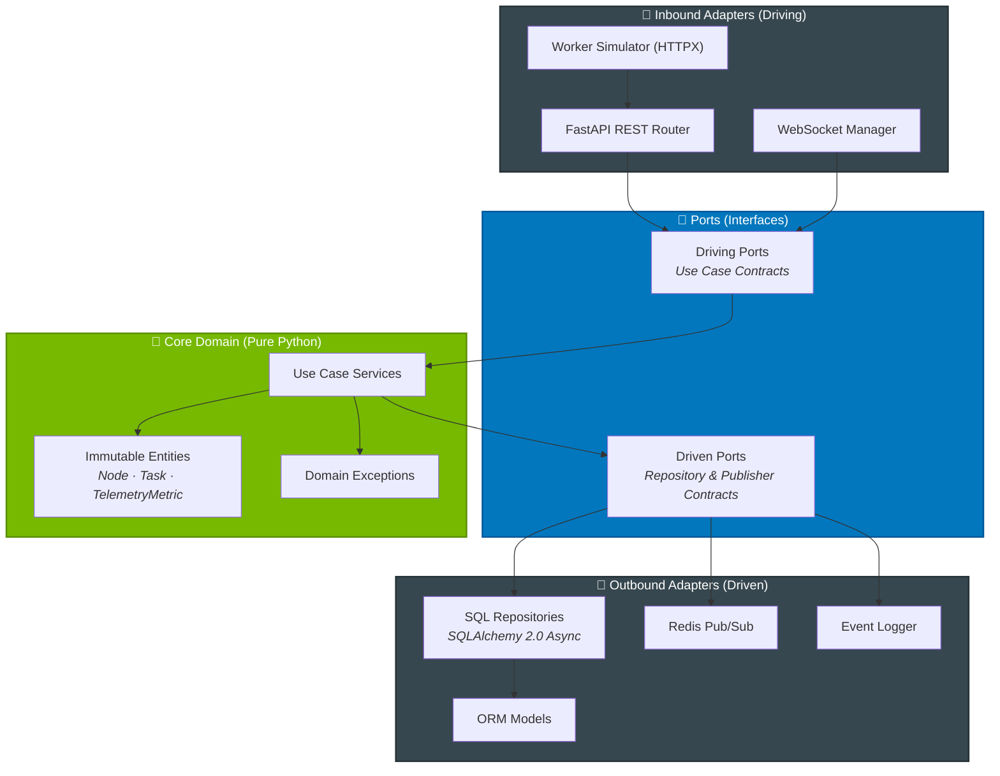

<div align="center">

# ⚡ GPU Fleet Commander

**Enterprise-Grade Control Plane for Distributed GPU Infrastructure**

[](https://github.com/Casta2007-ccs/gpu-fleet-commander/actions)
[](https://www.python.org/)
[](LICENSE)
[-6C3483.svg)](#-architectural-blueprint)
[](https://github.com/astral-sh/ruff)
[](https://mypy-lang.org/)

[](https://fastapi.tiangolo.com/)
[](https://docs.pydantic.dev/)
[-D71F00.svg)](https://www.sqlalchemy.org/)
[](https://www.postgresql.org/)
[](https://redis.io/)
[](https://www.docker.com/)

---

A high-performance, fully asynchronous **control plane** for orchestrating distributed GPU computing infrastructure at scale — from cloud server clusters to edge NVIDIA Jetson nodes. Handles real-time node provisioning, idempotent task dispatching, hardware telemetry ingestion, and live metric streaming via WebSockets.

Built with **Pure Hexagonal Architecture** where the core domain layer contains zero framework dependencies — no FastAPI, no SQLAlchemy, no Pydantic — ensuring complete testability, infrastructure portability, and clean separation of concerns.

[Getting Started](#-getting-started) · [Architecture](#-architectural-blueprint) · [API Reference](#-api-reference) · [Testing](#-testing--quality-assurance) · [Contributing](#-contributing)

</div>

---

## Table of Contents

- [Key Features](#-key-features)
- [Getting Started](#-getting-started)
- [Architectural Blueprint](#-architectural-blueprint)
- [Project Structure](#-project-structure)
- [API Reference](#-api-reference)
- [Testing & Quality Assurance](#-testing--quality-assurance)
- [Development Workflow](#-development-workflow)
- [Deployment](#-deployment)
- [Engineering Decisions & Trade-offs](#-engineering-decisions--trade-offs)
- [Tech Stack](#-tech-stack)
- [Roadmap](#-roadmap)
- [Contributing](#-contributing)
- [License](#-license)

---

## 🎯 Key Features

| Category | Feature | Description |
|:---|:---|:---|
| **Architecture** | Hexagonal (Ports & Adapters) | Core domain is 100% pure Python — zero imports from FastAPI, SQLAlchemy, or Pydantic. Swap databases, frameworks, or transport layers without touching business logic. |
| **Performance** | Fully Async I/O | End-to-end `async/await` with FastAPI, SQLAlchemy 2.0 async engine (`asyncpg`), and Redis `asyncio` client. Non-blocking from HTTP ingress to database persistence. |
| **Security** | API Key Authentication | All REST endpoints require `X-API-Key` headers. WebSocket connections validate tokens via query parameters before accepting the protocol upgrade. XSS-hardened dashboard UI. |
| **Reliability** | Idempotent Task Engine | Client-provided `idempotency_key` tokens prevent duplicate task creation in distributed retry loops. State machine transitions enforce valid lifecycle paths. |
| **Observability** | Real-time Telemetry | Live CPU, GPU, and temperature metrics streamed via WebSocket to an NVIDIA-themed dashboard. Historical telemetry queryable via REST API with configurable pagination. |
| **Scalability** | Redis Pub/Sub Broker | Telemetry fan-out across multiple API worker processes via Redis channels. Automatic reconnection with exponential backoff. Graceful fallback to in-memory broadcast. |
| **Data Integrity** | Immutable Domain Entities | Frozen dataclasses with copy-on-write state transitions (`dataclasses.replace`). Foreign key constraints enforce referential integrity at the database level. |
| **DevOps** | One-Command Deployment | `docker compose up --build` launches PostgreSQL, Redis, API server, and simulated GPU workers with health checks and cascading dependency ordering. |

---

## 🚀 Getting Started

### Prerequisites

- **Docker & Docker Compose** (recommended) — or Python 3.12+ for local development
- **Git**

### Option A: Docker Compose (Recommended)

Launch the entire stack — database, message broker, API, dashboard, and simulated workers — in under 60 seconds:

```bash
git clone https://github.com/Casta2007-ccs/gpu-fleet-commander.git
cd gpu-fleet-commander

docker compose up --build
```

| Service | URL | Description |
|:---|:---|:---|
| Dashboard | [`http://localhost:8000`](http://localhost:8000) | Real-time fleet telemetry control panel |
| API Docs | [`http://localhost:8000/docs`](http://localhost:8000/docs) | Interactive OpenAPI (Swagger) documentation |
| Health Check | [`http://localhost:8000/health`](http://localhost:8000/health) | Liveness probe endpoint |

### Option B: Local Development

```bash
git clone https://github.com/Casta2007-ccs/gpu-fleet-commander.git
cd gpu-fleet-commander

# Create virtual environment and install dependencies
python -m venv venv
source venv/bin/activate  # Windows: .\venv\Scripts\activate
pip install -r requirements.txt -r requirements-dev.txt

# Start the API server (requires PostgreSQL and Redis running separately)
uvicorn cmd.api.main:app --reload --host 0.0.0.0 --port 8000
```

In a separate terminal, launch the GPU worker simulator:

```bash
python cmd/worker/main.py
```

### Option C: Flox / Nix (Declarative Environment)

```bash
git clone https://github.com/Casta2007-ccs/gpu-fleet-commander.git
cd gpu-fleet-commander
flox activate --start-services

make init && make start && make create-db
make run
```

---

## 🏗️ Architectural Blueprint

The system follows **Hexagonal Architecture** (also known as Ports & Adapters), enforcing a strict unidirectional dependency rule: all dependencies point inward toward the core domain.



### Why Hexagonal?

| Benefit | How It's Implemented |
|:---|:---|
| **Testability** | Core services are tested with pure in-memory fakes — no database, no HTTP server, no containers needed. Tests run in < 0.5s. |
| **Portability** | Swap PostgreSQL for DynamoDB, or FastAPI for gRPC, by implementing new adapters. Zero changes to domain logic. |
| **Readability** | Each layer has a single responsibility. New contributors can understand the domain without learning the infrastructure. |

---

## 📂 Project Structure

```
gpu-fleet-commander/
│
├── cmd/                                # Application entrypoints
│   ├── api/
│   │   └── main.py                     # FastAPI app, lifespan, CORS, exception handlers
│   └── worker/
│       └── main.py                     # Async GPU worker simulator (HTTPX client)
│
├── src/                                # Application source code
│   ├── core/                           # 🟢 Pure domain — ZERO framework imports
│   │   ├── domain/
│   │   │   ├── entities.py             # Frozen dataclasses: Node, Task, TelemetryMetric
│   │   │   └── exceptions.py           # Domain exception hierarchy
│   │   ├── ports/
│   │   │   └── interfaces.py           # Abstract driving & driven port contracts
│   │   └── use_cases/
│   │       ├── node_provisioning.py     # Node registration & heartbeat processing
│   │       ├── task_orchestrator.py     # Task creation, dispatch & state transitions
│   │       └── telemetry_ingestion.py   # Metrics ingestion & historical retrieval
│   │
│   └── adapters/                       # 🔵 Infrastructure implementations
│       ├── inbound/
│       │   ├── api_schemas.py           # Pydantic V2 request/response DTOs
│       │   ├── routers.py              # REST endpoint definitions & DI wiring
│       │   └── websocket_manager.py     # WebSocket connection pool & fan-out
│       └── outbound/
│           ├── database.py              # Async engine factory & session provider
│           ├── event_publisher.py       # Logging-based event publisher
│           ├── orm_models.py            # SQLAlchemy ORM table mappings
│           └── sql_repositories.py      # Async repository implementations
│
├── tests/
│   ├── unit/                            # Fast domain tests with in-memory fakes
│   │   ├── fakes.py                     # Test doubles for all driven ports
│   │   ├── test_node_provisioning.py
│   │   ├── test_task_orchestrator.py
│   │   └── test_telemetry_ingestion.py
│   └── integration/                     # Database tests with SQLite async engine
│       └── test_sql_repositories.py
│
├── public/
│   └── index.html                       # Real-time dashboard (Tailwind + Chart.js)
├── scripts/
│   └── generate_openapi.py              # OpenAPI schema export utility
├── docs/
│   ├── openapi.json                     # Exported OpenAPI 3.1 specification
│   └── adr/                             # Architecture Decision Records
│
├── .github/workflows/ci.yml            # GitHub Actions CI pipeline
├── Dockerfile                           # Multi-stage build, non-root runtime
├── docker-compose.yml                   # Full stack orchestration
├── Makefile                             # Developer task automation
├── pyproject.toml                       # Ruff, Mypy & Pytest configuration
├── requirements.txt                     # Production dependencies
└── requirements-dev.txt                 # Development & testing dependencies
```

---

## 📡 API Reference

All endpoints require `X-API-Key` authentication unless otherwise noted. Full interactive documentation is available at `/docs` when the server is running.

### System

| Method | Endpoint | Description | Status Codes |
|:---:|:---|:---|:---|
| `GET` | `/` | Fleet control dashboard | `200` |
| `GET` | `/health` | Liveness probe | `200` |

### Nodes

| Method | Endpoint | Description | Status Codes |
|:---:|:---|:---|:---|
| `GET` | `/v1/nodes` | List all registered worker nodes | `200` `401` |
| `POST` | `/v1/nodes` | Register a new GPU worker node | `201` `401` `409` |
| `POST` | `/v1/nodes/{id}/heartbeat` | Record keepalive heartbeat | `204` `401` `404` |

### Telemetry

| Method | Endpoint | Description | Status Codes |
|:---:|:---|:---|:---|
| `GET` | `/v1/nodes/{id}/telemetry?limit=N` | Retrieve recent metrics for a node | `200` `401` `404` |
| `POST` | `/v1/nodes/{id}/telemetry` | Ingest hardware telemetry data point | `201` `401` `404` |

### Tasks

| Method | Endpoint | Description | Status Codes |
|:---:|:---|:---|:---|
| `GET` | `/v1/tasks/{id}` | Retrieve task details by ID | `200` `401` `404` |
| `POST` | `/v1/tasks` | Create a computational task (idempotent) | `201` `401` |
| `POST` | `/v1/tasks/{id}/dispatch` | Dispatch task to an online node | `200` `401` `404` `409` |
| `POST` | `/v1/tasks/{id}/transition` | Transition task lifecycle state | `200` `401` `404` `409` `422` |

### WebSocket

| Protocol | Endpoint | Description | Auth |
|:---:|:---|:---|:---|
| `WS` | `/v1/ws/telemetry?api_key=TOKEN` | Real-time telemetry stream | Query parameter |

<details>
<summary><strong>Example: Register a Node</strong></summary>

```bash
curl -X POST http://localhost:8000/v1/nodes \
  -H "Content-Type: application/json" \
  -H "X-API-Key: gpu_fleet_secure_token_2026" \
  -d '{"hostname": "gpu-node-01", "hardware_specs": {"gpu": "NVIDIA H100", "memory_gb": 80}}'
```

**Response** (`201 Created`):
```json
{
  "id": "a1b2c3d4-...",
  "hostname": "gpu-node-01",
  "status": "ONLINE",
  "hardware_specs": {"gpu": "NVIDIA H100", "memory_gb": 80},
  "last_heartbeat": "2026-07-21T16:00:00Z"
}
```
</details>

<details>
<summary><strong>Example: Ingest Telemetry</strong></summary>

```bash
curl -X POST http://localhost:8000/v1/nodes/a1b2c3d4-.../telemetry \
  -H "Content-Type: application/json" \
  -H "X-API-Key: gpu_fleet_secure_token_2026" \
  -d '{"cpu_usage": 45.2, "gpu_usage": 92.8, "temperature": 71.5}'
```

**Response** (`201 Created`):
```json
{
  "node_id": "a1b2c3d4-...",
  "timestamp": "2026-07-21T16:00:05Z",
  "cpu_usage": 45.2,
  "gpu_usage": 92.8,
  "temperature": 71.5
}
```
</details>

<details>
<summary><strong>Example: Create & Dispatch a Task</strong></summary>

```bash
# Create task
curl -X POST http://localhost:8000/v1/tasks \
  -H "Content-Type: application/json" \
  -H "X-API-Key: gpu_fleet_secure_token_2026" \
  -d '{"idempotency_key": "train-resnet-v3", "payload": {"model": "resnet50", "epochs": 100}}'

# Dispatch to a node
curl -X POST http://localhost:8000/v1/tasks/{task_id}/dispatch \
  -H "Content-Type: application/json" \
  -H "X-API-Key: gpu_fleet_secure_token_2026" \
  -d '{"node_id": "a1b2c3d4-..."}'

# Mark as completed
curl -X POST http://localhost:8000/v1/tasks/{task_id}/transition \
  -H "Content-Type: application/json" \
  -H "X-API-Key: gpu_fleet_secure_token_2026" \
  -d '{"target_status": "COMPLETED"}'
```
</details>

---

## 🧪 Testing & Quality Assurance

The project enforces a strict quality gate: **24 tests passing**, **zero linting errors**, and **zero type-checking issues** across 32 source files.

### Test Pyramid

| Layer | Framework | Scope | Speed |
|:---|:---|:---|:---|
| **Unit Tests** | pytest + pytest-asyncio | Domain services with in-memory fakes | ~0.1s |
| **Integration Tests** | pytest + aiosqlite | Full SQL repository CRUD against SQLite | ~0.3s |
| **Static Analysis** | Ruff | Linting, import sorting, style enforcement | ~0.2s |
| **Type Checking** | Mypy (strict) | Static type validation across all modules | ~1.0s |

### Running Tests

```bash
# Full test suite
python -m pytest

# Verbose output with test names
python -m pytest -v

# Unit tests only (no database)
python -m pytest tests/unit/

# Integration tests only
python -m pytest tests/integration/
```

### Static Analysis

```bash
# Lint check
python -m ruff check src/ cmd/ tests/

# Type check
python -m mypy --ignore-missing-imports --explicit-package-bases src/ cmd/ tests/
```

---

## 🛠️ Development Workflow

The `Makefile` provides shortcuts for common development tasks:

```bash
make help       # Show all available commands
make install    # Install Python dependencies
make run        # Start FastAPI dev server with hot-reload
make test       # Run unit test suite
make lint       # Run Ruff linting + Mypy type checking
make format     # Auto-format code with Ruff
make clean      # Remove __pycache__, .pytest_cache, etc.
```

### Environment Variables

| Variable | Default | Description |
|:---|:---|:---|
| `DATABASE_URL` | `sqlite+aiosqlite:///./dev.db` | Async database connection string |
| `REDIS_URL` | `redis://localhost:6379/0` | Redis connection string for Pub/Sub |
| `API_KEY` | `gpu_fleet_secure_token_2026` | API authentication token |

---

## 🐳 Deployment

### Docker Compose Services

```bash
docker compose up --build     # Build and start all services
docker compose down -v        # Stop and remove volumes
docker compose logs -f api    # Follow API server logs
```

| Service | Image | Port | Health Check |
|:---|:---|:---:|:---|
| `postgres` | `postgres:16-alpine` | `5432` | `pg_isready` |
| `redis` | `redis:7-alpine` | `6379` | `redis-cli ping` |
| `api` | Custom (multi-stage) | `8000` | HTTP `/health` |
| `worker-1` | Custom | — | Depends on `api` |
| `worker-2` | Custom | — | Depends on `api` |

### Container Security

- Multi-stage build minimizes attack surface (no build tools in runtime image)
- Runs as non-root `appuser` (UID 1000)
- `.dockerignore` excludes `.git`, `venv`, `__pycache__`, test artifacts
- Production dependencies isolated from dev tools (`requirements.txt` vs `requirements-dev.txt`)

---

## 🧠 Engineering Decisions & Trade-offs

Building a production-grade control plane required navigating several non-trivial engineering challenges. Each decision is documented here for transparency and as a learning reference.

<details>
<summary><strong>1. WebSocket Authentication & ASGI Handshake Ordering</strong></summary>

**Problem:** Attempting to close an unauthenticated WebSocket before accepting it raises `RuntimeError: Unexpected ASGI message 'websocket.close'` in Starlette/ASGI.

**Solution:** The endpoint calls `await websocket.accept()` first, then validates the API key. If authentication fails, it sends a clean close with code `WS_1008_POLICY_VIOLATION`. This respects the ASGI protocol while still rejecting unauthorized connections immediately.
</details>

<details>
<summary><strong>2. Domain Exception Mapping to HTTP Status Codes</strong></summary>

**Problem:** Domain services raise semantically rich exceptions (`NodeNotFoundError`, `InvalidTransitionTargetError`), but letting them bubble up unhandled produces generic `500 Internal Server Error` responses — leaking implementation details and providing no actionable feedback to API consumers.

**Solution:** Each router endpoint wraps service calls in explicit try/except blocks that map domain exceptions to appropriate HTTP status codes: `404` for not found, `409` for state conflicts, `422` for invalid transitions. Global exception handlers in the FastAPI app catch any unhandled cases as a safety net.
</details>

<details>
<summary><strong>3. Pydantic V2 Compatibility with Mypy Static Analysis</strong></summary>

**Problem:** Returning raw domain dataclass instances from endpoints and relying on Pydantic's `from_attributes=True` for automatic conversion worked at runtime but caused Mypy to flag type incompatibilities (`got Node, expected NodeResponse`).

**Solution:** Endpoints explicitly call `NodeResponse.model_validate(domain_entity)` to construct DTOs. This satisfies both runtime behavior and static type checking with zero `type: ignore` suppressions.
</details>

<details>
<summary><strong>4. Redis Pub/Sub Resilience Under Network Partitions</strong></summary>

**Problem:** A Redis subscriber running as a background task dies permanently on connection loss, silently breaking all real-time telemetry streaming for the lifetime of the API process.

**Solution:** The Redis listener runs inside an infinite retry loop with exponential backoff. On disconnect, it logs the error, waits, and re-subscribes to the `telemetry_channel`. If Redis is entirely unavailable at startup, the system falls back to local in-memory broadcast — degraded but functional.
</details>

<details>
<summary><strong>5. Immutable Entities & Copy-on-Write State Transitions</strong></summary>

**Problem:** Mutable domain objects in concurrent async handlers risk race conditions where one coroutine reads stale state while another mutates it.

**Solution:** All domain entities (`Node`, `Task`, `TelemetryMetric`) are frozen dataclasses. State updates produce new instances via `dataclasses.replace()`, ensuring the original is never modified. This eliminates an entire class of concurrency bugs by construction.
</details>

<details>
<summary><strong>6. Database Referential Integrity for Orphan Prevention</strong></summary>

**Problem:** `TaskORM.node_id` and `TelemetryMetricORM.node_id` stored plain strings without foreign key constraints. Deleting a node could leave orphaned tasks and telemetry records with no way to detect the inconsistency.

**Solution:** Added `ForeignKey("nodes.id")` constraints to ORM models, delegating integrity enforcement to the database engine. This guarantees that tasks and telemetry metrics always reference valid, existing nodes.
</details>

---

## 🔧 Tech Stack

| Layer | Technology | Purpose |
|:---|:---|:---|
| **Web Framework** | FastAPI 0.111 | Async HTTP & WebSocket server with auto-generated OpenAPI docs |
| **Validation** | Pydantic V2 | Request/response DTO schemas with `from_attributes` ORM support |
| **ORM** | SQLAlchemy 2.0 (Async) | Async database access with `asyncpg` driver |
| **Database** | PostgreSQL 16 | Production persistence (Alpine Docker image) |
| **Message Broker** | Redis 7 | Pub/Sub telemetry fan-out across worker processes |
| **ASGI Server** | Uvicorn | High-performance ASGI server for production |
| **HTTP Client** | HTTPX | Async HTTP client for worker simulator |
| **Containerization** | Docker + Compose | Multi-stage builds, health checks, service orchestration |
| **CI/CD** | GitHub Actions | Automated linting, compilation checks, and test execution |
| **Linting** | Ruff | Fast Python linter and formatter (pycodestyle, pyflakes, isort, bugbear) |
| **Type Checking** | Mypy | Static type analysis with strict mode |
| **Testing** | pytest + pytest-asyncio | Async test runner with fixture-based dependency injection |
| **Dashboard** | Tailwind CSS + Chart.js | Real-time telemetry visualization via WebSocket |

---

## 🗺️ Roadmap

- [ ] **Prometheus Metrics Exporter** — `/metrics` endpoint for Grafana integration
- [ ] **gRPC Transport Adapter** — Alternative inbound adapter for high-throughput node communication
- [ ] **Node Health Watchdog** — Automatic `OFFLINE` status transition after heartbeat timeout
- [ ] **Role-Based Access Control** — JWT-based authentication with scoped permissions
- [ ] **Horizontal Autoscaling** — Kubernetes-native deployment with HPA based on telemetry load
- [ ] **OpenTelemetry Tracing** — Distributed request tracing across API and worker nodes

---

## 🤝 Contributing

Contributions are welcome. Please follow these guidelines:

1. **Fork** the repository and create a feature branch from `main`
2. **Write tests** for any new functionality
3. **Run quality checks** before submitting:
   ```bash
   make test && make lint
   ```
4. **Open a Pull Request** with a clear description of the change

---

## 📄 License

This project is licensed under the **MIT License**. See the [LICENSE](LICENSE) file for details.

---

<div align="center">

**Built with precision.** Engineered for scale.

*GPU Fleet Commander — © 2026*

</div>
