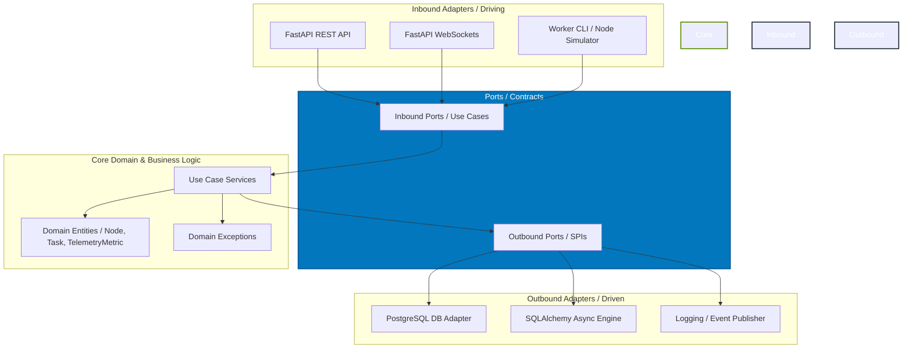

# ⚡ GPU Fleet Commander ⚡

[](https://github.com/Casta2007-ccs/gpu-fleet-commander/actions)
[](https://opensource.org/licenses/MIT)
[](https://www.python.org/)
[](https://github.com/astral-sh/ruff)
[](https://flox.dev/)
[](https://en.wikipedia.org/wiki/Hexagonal_architecture_(software))
[]()

**GPU Fleet Commander** is an enterprise-grade, high-performance Control Plane designed for orchestrating distributed computing resources (such as server clusters or NVIDIA Jetson edge systems). It handles real-time node registration, heartbeat telemetry monitoring, and idempotent task dispatching, broadcasting live metrics via WebSockets to a dedicated monitoring dashboard.

Built with a **pure domain model** following strict **Hexagonal Architecture** (Ports and Adapters) principles, the system isolates core business logic from databases and web frameworks, facilitating elite testability and scalability.

---

## 🏗️ Architectural Blueprint

The codebase enforces a unidirectional dependency flow pointing **inward** toward the pure domain model. Infrastructure components (Web APIs, Databases, WebSockets, Message Brokers) are plugged in via interfaces (Ports).



For a comprehensive explanation of our modular structure, see our [Architecture & Development Guide](file:///C:/Users/Usuario/Documents/antigravity/keen-noether/docs/DEVELOPMENT_AND_ARCHITECTURE.md).

---

## ✨ Key Technical Highlights

### 1. Pure Domain Isolation
No ORM annotations (`SQLAlchemy`) or web decorators (`FastAPI`) touch the domain models. The domain is pure Python 3.12. This ensures that the core business logic remains unaffected by framework upgrades or infrastructure changes.

### 2. Immutable State Transitions
Entities are modeled using `@dataclass(frozen=True)`. State transitions return new mutated instances, eliminating side effects and enhancing safety against race conditions in concurrent execution environments:
```python
# State transition returning a new copy of the Node
def update_heartbeat(self, timestamp: datetime) -> "Node":
    return replace(self, last_heartbeat=timestamp, status=NodeStatus.ONLINE)
```

### 3. Asynchronous Execution Pipeline
All database operations (SQLAlchemy 2.0 + `asyncpg` + PostgreSQL) and API request handlers (FastAPI) are asynchronously configured, ensuring sub-second response times under concurrent telemetry loads.

### 4. WebSocket Live Telemetry Broadcasting
Incoming metric payloads from worker nodes are automatically broadcast to all connected WebSocket clients (`/v1/ws/telemetry`) in real-time, displaying live telemetry without database polling bottlenecks.

### 5. Task Idempotency
Built-in protection against network retries using client-provided idempotency keys. If a task creation request is duplicated, the system returns the existing task without altering database state.

---

## 📂 Project Structure

```text
.
├── .github/
│   ├── workflows/
│   │   └── ci.yml              # GitHub Actions CI Workflow (Postgres 16 + Test Suite)
│   └── PULL_REQUEST_TEMPLATE.md # Developer PR Template and Quality Gates
├── .flox/                      # Declarative Nix-based virtual environments
│   └── env/
│       └── manifest.toml       # Environment packages (Postgres, Redis, Python, uv)
├── cmd/
│   ├── api/
│   │   └── main.py             # Entrypoint & FastAPI setup (global exception handling)
│   └── worker/
│       └── main.py             # GPU Worker Client Simulator (HTTPX Async Client)
├── public/
│   └── index.html              # NVIDIA-themed Real-time Web Dashboard (Tailwind + Chart.js)
├── src/
│   ├── core/                   # 🛑 Pure Domain - NO FRAMEWORKS
│   │   ├── domain/             # Entities, Value Objects, Domain Exceptions
│   │   ├── ports/              # Inbound & Outbound Interfaces (contracts)
│   │   └── use_cases/          # Business logic services (Use Cases)
│   ├── adapters/               # 🔌 Infrastructure & Adapters (Web, DB, WebSockets)
│   │   ├── inbound/            # FastAPI routers, WebSocket manager, Pydantic schemas
│   │   └── outbound/           # SQLAlchemy 2.0 ORM models & Async repositories
│   └── config/                 # Dependency injection configurations
├── tests/
│   ├── unit/                   # High-speed unit tests (uses mock Fakes)
│   └── integration/            # Test adapters against real Postgres inside Flox
├── docs/
│   ├── adr/                    # Architectural Decision Records (ADRs 0001-0003)
│   └── DEVELOPMENT_AND_ARCHITECTURE.md # Detailed development guide
├── Makefile                    # Developer Task Runner (build, test, format, database controls)
├── pyproject.toml              # Ruff and Pytest configuration specifications
├── requirements.txt            # Poetry exported package requirements
└── LICENSE                     # MIT Open Source License
```

---

## 🛠️ API & WebSockets Reference

| Method | Endpoint | Description | Payload | Success | Errors |
|:---|:---|:---|:---|:---|:---|
| **GET** | `/` | Serve HTML Web Dashboard | None | `200 OK` | None |
| **GET** | `/health` | API Health check | None | `200 OK` | None |
| **POST** | `/v1/nodes` | Register a new worker node | `{"hostname": "str", "hardware_specs": {}}` | `201 Created` | `409 Conflict` |
| **POST** | `/v1/nodes/{id}/heartbeat` | Ingest node heartbeat (keepalive) | None | `204 No Content` | `404 Not Found` |
| **POST** | `/v1/nodes/{id}/telemetry` | Ingest node metric payload | `{"cpu_usage": float, "gpu_usage": float, "temperature": float}` | `201 Created` | `404 Not Found` |
| **POST** | `/v1/tasks` | Create a task (Idempotent) | `{"idempotency_key": "str", "payload": {}}` | `201 Created` | `400 Bad Request` |
| **POST** | `/v1/tasks/{id}/dispatch` | Assign task to an online node | Query: `?node_id=str` | `200 OK` | `404/409 Conflict` |
| **POST** | `/v1/tasks/{id}/transition` | Transition task execution status | Query: `?target_status=str` | `200 OK` | `404/409 Conflict` |
| **WS** | `/v1/ws/telemetry` | Real-time telemetry broadcast feed | WebSocket Connection | `101 Switching` | None |

---

## 🎮 End-to-End Simulation Quickstart

Experience the entire system working in real-time under 60 seconds.

### 1. Initialize and Start Databases (via Flox/Nix)
If you are using Flox, start the PostgreSQL services:
```bash
flox activate --start-services
make init      # Initialize local cluster files
make start     # Start PostgreSQL service in background
make create-db # Create 'gpu_fleet' database
```

### 2. Run the Control Plane API
Launch the FastAPI development server:
```bash
make run
```
*The API is now running on `http://localhost:8000/`. You can open this URL in your web browser to view the **NVIDIA-themed Live Dashboard**.*

### 3. Spin Up Simulated GPU Worker Nodes
Open one or more new terminal sessions and run the worker simulator client:
```bash
# Registers a simulated worker node (e.g. RTX 4090) and streams metrics every 3s
python cmd/worker/main.py
```
*(Optionally run multiple instances in different terminal tabs to simulate a fleet of concurrent GPUs).*

### 4. Watch Live Telemetry
Open **`http://localhost:8000/`** in your browser. You will see:
- Node names dynamically added to the selector.
- Live-drawn charts for CPU, GPU, and Temperature updated every 3 seconds via WebSockets.
- A rolling console displaying raw telemetry JSON payloads as they land.

---

## ⚡ Developer Task Runner (Makefile)

A `Makefile` is included to unify workflow commands across the development team:

| Target | Description |
|:---|:---|
| `make install` | Install Python dependencies via `uv` |
| `make init` | Initialize PostgreSQL database files in space-user |
| `make start` | Start PostgreSQL local background services |
| `make stop` | Stop background PostgreSQL services |
| `make create-db` | Create the development SQL database |
| `make run` | Run FastAPI server on `localhost:8000` with reload |
| `make test` | Execute the unit test suite |
| `make format` | Automatically style and format code with Ruff |
| `make lint` | Run Ruff linter and MyPy type check validation |
| `make clean` | Remove temporary cache and pycache folders |

---

## 💡 Technical Decisions & Architectural Context

### Why Hexagonal Architecture?
Infrastructure changes frequently. By structuring the control plane with clear Inbound and Outbound ports, we can swap PostgreSQL for a specialized time-series database (e.g., InfluxDB or TimescaleDB) to handle millions of telemetry records, **without modifying a single line of business logic** in the core domain.

### Architectural Decision Records (ADRs)
We record all major design choices as Architectural Decision Records to maintain technical transparency:
1. **[ADR 0001: Record Architecture Decisions](file:///C:/Users/Usuario/Documents/antigravity/keen-noether/docs/adr/0001-record-architecture-decisions.md)**
2. **[ADR 0002: Use Hexagonal Architecture](file:///C:/Users/Usuario/Documents/antigravity/keen-noether/docs/adr/0002-use-hexagonal-architecture.md)**
3. **[ADR 0003: Use Asynchronous I/O](file:///C:/Users/Usuario/Documents/antigravity/keen-noether/docs/adr/0003-use-asynchronous-io.md)**

---

## 📄 License

This project is licensed under the terms of the MIT License. See [LICENSE](LICENSE) for details.
